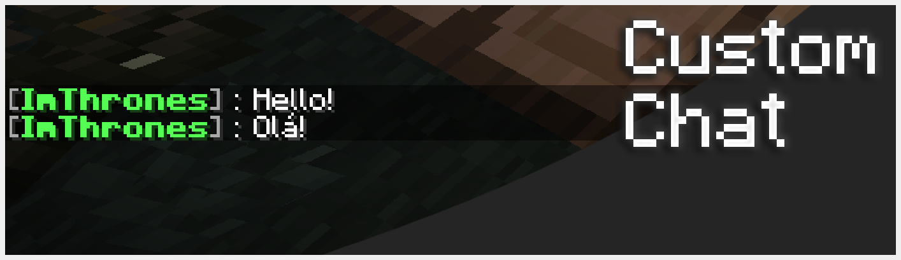
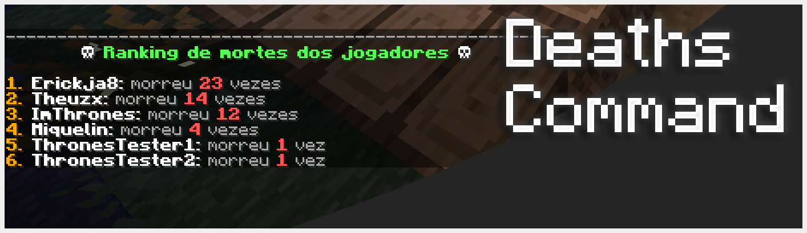

# 🍍 Pineapple Essentials - v1.1.3 `Minecraft Spigot 1.21.X`

**Pineapple Essentials** é um plugin leve e de qualidade de vida (QoL) feito em Spigot, pensado para tornar a experiência no seu servidor mais divertida! 🌟

Com o **Pineapple Essentials**, você terá acesso a comandos como:
- `/mortes` — Ranking de quantas mortes cada player tem.
- `/kit` — Pegue rapidamente seus kits iniciais (personalizável).
- `/comandos` — Nunca mais esqueça um comando; todos os essenciais em um só lugar.
- em breve mais...

Perfeito para servidores pequenos que querem melhorar a jogabilidade sem sobrecarregar o servidor!

---

## Screenshots
*Chat Customizável*

*TabList Customizável*

*Ranking de mortes do servidor*

